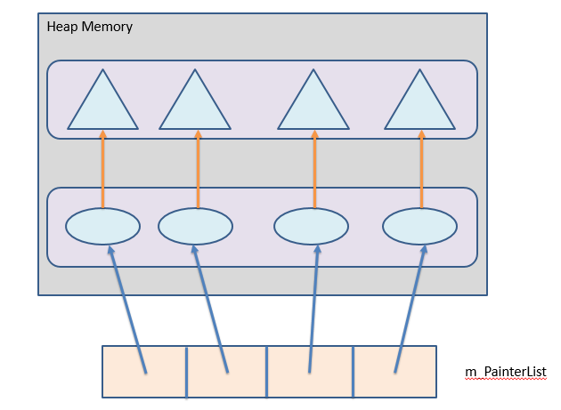
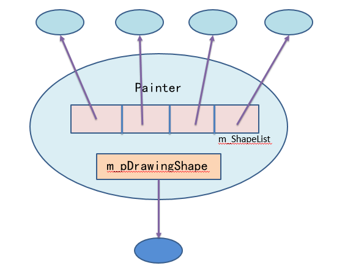

# 目录说明
- `Drawboard.Main` 画板主程序工程文件，使用`VS 2015`创建
- `PluginProj` 插件工程文件，使用`QtCreator`创建 (QT版本：`qt-opensource-windows-x86-msvc2015-5.8.0`)
- `drawboard` 最终的产品

# 设计模式
插件工程使用*工厂方法模式*，抽象工厂类为`ShapeFactory`和`PainterFactory`，对应的抽象产品类为`Shape`和`Painter`.

# 画板是如何运行的？
## 1、初始化过程
画板启动后加载插件`XxxPainterFactory.DLL`，将`XxxPainterFactory::createPainter()`创建的`Painter`子类对象保存在`MainWindow::m_PainterList`. `Painter`子类对象被创建时，构造函数调用`ShapeFactory::createShape()`创建该`Painter`对应的`Shape`.

`MainWindow::m_PainterList`初始化后的情形如下:



- 蓝色箭头：`MainWindow::m_PainterList`存放的`Painter*`
- 椭圆： `XxxPainterFactory::createPainter()`创建的`Painter`子类对象
- 橙色箭头：每个`Painter`子类对象的`m_pDrawingShape`指针
- 三角形：与每个`Painter`绑定的`Shape`子类对象.
每个`Painter`(椭圆)都有一个数据成员`m_ShapeList`，保存所有自己绘制的图形.

选择绘制不同的图形，只需将`MainWindow::m_PainterList`中的`Painter*`赋给`MainWindow::m_pCurrentPainter`，使得`m_pCurrentPainter`指向不同的`Painter`子类对象（椭圆）.该操作由`MainWindow::init()`完成.

## 2、绘制过程中的`Painter`:


每个椭圆表示一个`Shape`子类对象.

## 3、画板的重绘策略
重绘时，画板遍历`m_PainterList`中的`Painter`，每个`Painter`遍历自己的`m_ShapeList`，`m_pDrawingShape`则被实时地动态显示. 每次切换图形绘制时，`m_pCurrentPainter->m_pDrawingShape`已被保存在`m_ShapeList`中，`m_pDrawingShape`又将指向新的`Shape`，具体的处理策略如下：

## 4、绘制结束后的处理策略
### 法一：
`MainWindow::m_pCurrentPainter`指向的`Painter`先让自己的`ShapeFactory`创建一个新的`Shape`，并将`m_pDrawinigShape`指向的`Shape`的关键信息拷贝给这个新`Shape`，再将指向新`Shape`的指针保存到`m_ShapeList`，其后销毁`m_pDrawingShape`指向`Shape`，最后再创建一个新的`Shape`，另m_pDrawingShape指向它.上述操作由`Painter::Save()`完成. 但是`Painter::save()`的关键代码其实可以简化为：

### 法二：
```
m_ShapeList.push_back(m_pDrawingShape);
m_pDrawingShape = m_pShapeFactory->createShape();
```
该方案保留了原有的`Shape`，也不需要调用`ShapeFactory::createShape(Shape*)`，但对于多边形不可行(后续无法拖拽之). 注意到`ShapeFactory::createShape(Shape*)`是通过`Shape::setKeyPoints`完成关键信息的拷贝的，而`MyPolygon`重写了该函数，因此在现有的继承关系下，法二是较为合理的选择（事实上，`ShapeFactory::createShape(Shape*)`是多边形专用的，其他图形只需`ShapeFactory::createShape()`，但为了统一，全部图形绘制结束后的处理方式都采用法一）.

## 5、拖动
画板遍历`m_PainterList`，每个`Painter`遍历自己的`m_ShapeList`，找到需要被拖动的`Shape`后，画板将`m_pCurrentPainter`指向那个`Painter`，并设置该`Painter`的数据成员`m_pDraggingShape`指向`m_ShapeList`中需要被拖动的`Shape`. 此后这个`Painter`将根据鼠标轨迹实时修改`m_pDraggingShape`指向的`Shape`，并重绘之.

拖动过程并未产生新的`Shape`，而是修改由`m_pCurrentPainter`修改自己的`m_ShapeList`中的某个`Shape`，重绘时会反映出来.

