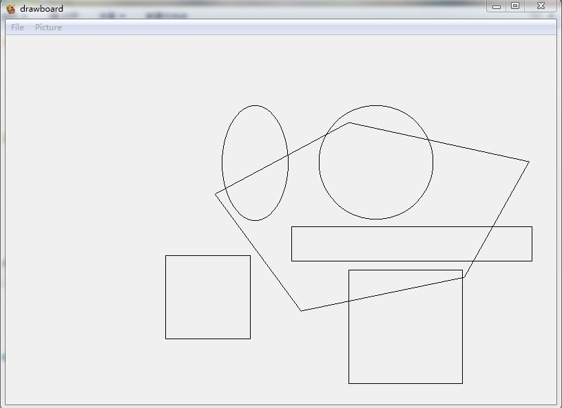

# 画板
一个简单的画图软件，来自[Bitman(工程组)](http://www.bitmen.org)的第一个课题，用于训练面向对象设计和插件式编程能力.

## 设计上的主要特点
- **多态**: 使用虚函数，让调用者不加区分地完成函数调用. 该特点体现在画板主程序对`Painter`类方法的调用上，以此实现对多种图形的操作.
- **继承**: 每次实现一个新的画图选项(比如画矩形)都需要子类化4个基类`Shape`,`Painter`,`ShapeFactory`,`PainterFactory`.
- **设计模式**: 插件工程使用*工厂方法模式*，抽象工厂类为`ShapeFactory`和`PainterFactory`，对应的抽象产品类为`Shape`和`Painter`.
- **插件式**: 所有的画图选项都以插件DLL的形式提供，由画板主程序加载.
- **多边形--增强画图功能的抽象性**: 多边形与其他基本几何图形不同，它的点集具有不确定性(the number of points is precarious)，而矩形和圆形之类的图形只需由2个点确定，如果要兼容多变形就需要对各种图形的处理策略进一步抽象.

## 功能特点
图形绘制、拖动，保存/打开图形数据文件

## 开发环境
- Windows7
- Visual Studio 2015 Community (QT5 plugin installed)
- QtCreator (qt-opensource-windows-x86-msvc2015-5.8.0`)

## 更多细节
[Click Here](./2.0/README.md)